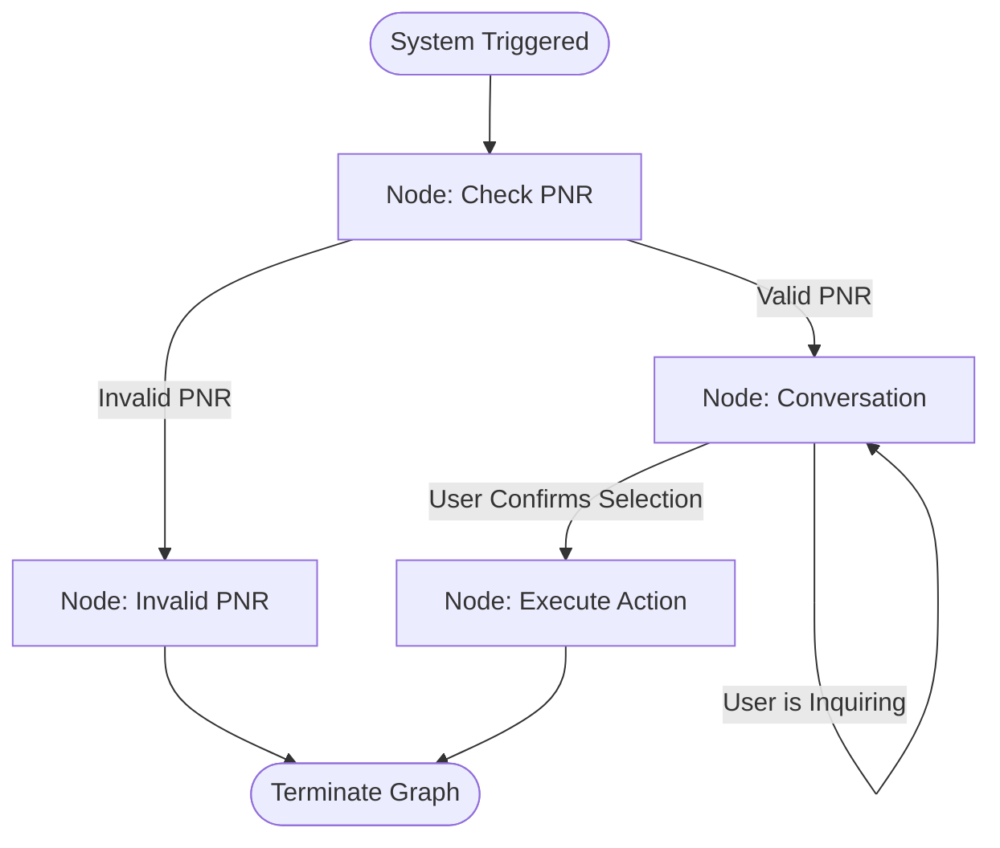

# ✈️ LangGraph & Local LLM Powered Autonomous Airline Assistant (MCP Server)

This project is an enterprise-grade **Agentic AI** prototype designed to autonomously mitigate customer grievances during operational crises such as flight cancellations or delays. The system operates entirely on local hardware—eliminating third-party API costs—and fully supports Anthropic's **Model Context Protocol (MCP)** standard.

## 🚀 Key Features

* **Local Large Language Model (Local LLM):** Meta's **Llama 3 (8B)** runs locally via **Ollama** on M1 Mac hardware. Complete data privacy is preserved with zero API call costs.
* **LangGraph State Graph Architecture:** Operations are strictly controlled using Nodes and Conditional Edges to enforce a deterministic workflow, reducing LLM hallucinations to zero.
* **Resilient Error Handling:** When a user inputs an invalid PNR code, the system gracefully routes the state through an error node to prevent crashes.
* **Anthropic MCP Integration:** The project operates as an MCP Server. It connects seamlessly to the Claude Desktop client as a "Tool," executing database write operations (`REBOOK` / `REFUND`) autonomously.
* **Interactive UI:** A sleek chat interface built with **Streamlit** allows end-users to communicate with the agent in real time.

## 🕸️ LangGraph Architecture Flow



## 🛠️ Installation & Execution

### 1. Install Dependencies
Activate your virtual environment and install all required libraries automatically:
```bash
pip install -r requirements.txt
```

### 2. Pull & Run the Local LLM
Ensure [Ollama](https://ollama.com) is installed on your machine, then download and test the model via terminal:
```bash
ollama run llama3:8b
```

### 3. Launch the Web UI (Streamlit)
To start the visual web interface in your browser:
```bash
python -m streamlit run gui.py
```

### 4. Continuous Terminal Chat Mode
To converse with the agent directly inside the terminal window without it closing automatically:
```bash
python app.py
```

### 5. Claude Desktop Configuration (MCP Connection)
To register this project as a live tool inside the Claude Desktop application, open or create your local config file at:
`~/Library/Application Support/Claude/claude_desktop_config.json`

Paste the following JSON configuration block inside it:
```json
{
  "mcpServers": {
    "airline-agent-server": {
      "command": "/Users/onurgumus/Airline_Project/.venv/bin/python",
      "args": [
        "/Users/onurgumus/Airline_Project/app.py",
        "--mcp"
      ]
    }
  }
}
```

#### 💡 Quick Pro-Tip: How to find your exact absolute paths?
If you have a different Mac username or moved this project to another folder, run these quick commands in your VS Code terminal to extract your paths instantly:
* **To find your exact Python path (`command`):** Run `which python` while your `.venv` is active.
* **To find your exact file directory (`args`):** Run `pwd` inside the project folder, and simply append `/app.py` to the end of the printed path.

## 📈 Engineering Takeaways
Through building this project, I gained deep hands-on experience in advanced Function Calling orchestration, State Management patterns, deterministic graph workflows, and exposing open-source models to modern enterprise ecosystems via the Model Context Protocol (MCP).
